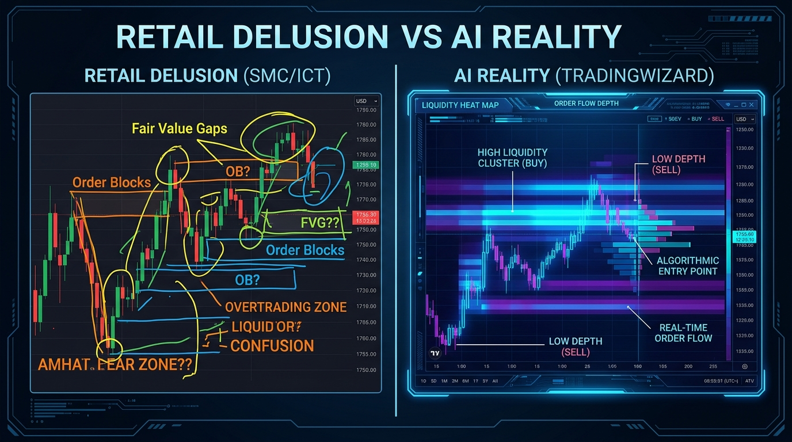

# SMC vs. AI Reality: The Clinical Translation Guide

Retail traders spend years learning "concepts" to make sense of the market. AI spends milliseconds reading the tape. This guide translates the human delusion into the clinical truth.

| Retail Concept (SMC/ICT) | AI Reality (Order Flow) | Why It Matters |
| :--- | :--- | :--- |
| **Fair Value Gap (FVG)** | **Order Book Thinness** | Price moves through "gaps" because there are no limit orders to stop it. It's not "unfair"; it's just empty. |
| **Order Block (OB)** | **Liquidity Magnet** | A concentration of previously executed volume that signals where high-intent participants might defend or hunt. |
| **Change of Character (CHoCH)** | **Aggressive Imbalance** | Market orders (aggression) are overwhelming limit orders (absorption). The trend hasn't "changed character"; it has just run out of liquidity. |
| **Liquidity Sweep / Stop Run** | **Delta Flush** | Clearing out the high-leverage retail cluster to create a path for larger position entry without slippage. |
| **Smart Money** | **The Market Maker Algorithm** | There is no secret cabal. There is only an algorithm designed to maintain efficiency and harvest liquidity. |

## The Visual

## Conclusion
Stop trading names. Start trading depth.

[Get the Truth at TradingWizard.ai](https://tradingwizard.ai)
